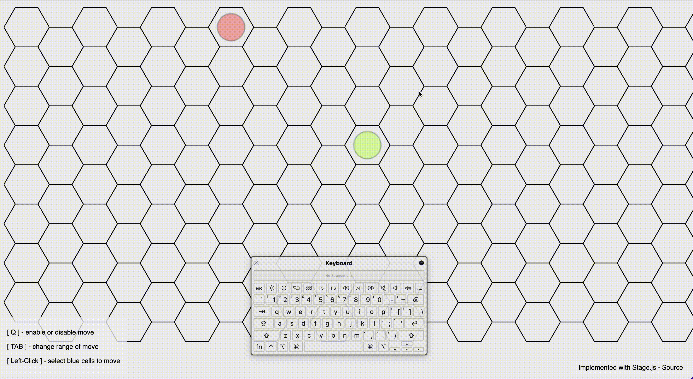

# Hexagon

- [Hexagon](#hexagon)
  - [Goal](#goal)
  - [Implementation](#implementation)
  - [Gameplay](#gameplay)
    - [Lv. 1](#lv-1)
    - [Future](#future)
  - [References](#references)
    - [Theories](#theories)
    - [Implementations](#implementations)
  - [Timeline & To-do List](#timeline--to-do-list)
    - [Versions](#versions)
    - [Elements](#elements)
    - [Gameplay](#gameplay-1)
    - [UI/UX](#uiux)
    - [Bugs](#bugs)
    - [Utilities](#utilities)

## Goal
Implement a game involving one or more players in the future, where they move, collaborate, and fight enemies in a hexagonal grid. 

## Implementation
This project is implemented in HTML5, CSS, and JavaScript with [Stage.js](https://piqnt.com/stage.js/).

## Gameplay
The player controls the character (represented as a circle) that starts from the center of the screen and will encounter random enemies.

### Lv. 1
The player toggles the moving range and wins if they move to the hexagon cell where the enemy resides.

### Future
Several forms of attack will be available for players to choose from. Different forms may have different ranges, distances, and damage.

## References
### Theories
* [Red Blob Games | Hexagonal Grids](https://www.redblobgames.com/grids/hexagons/)
* [石鸦的博客：战术级战棋设计思考随笔1-战棋分类](https://zafara-zd.github.io/blog/%E6%88%98%E6%9C%AF%E7%BA%A7%E6%88%98%E6%A3%8B%E8%AE%BE%E8%AE%A1%E6%80%9D%E8%80%83%E9%9A%8F%E7%AC%941-%E6%88%98%E6%A3%8B%E5%88%86%E7%B1%BB/)

### Implementations
* [Stage.js | 2D HTML5 rendering and layout engine](https://github.com/shakiba/stage.js)
* [eperezcosano/hexagonal-grid: How to draw a hexagonal grid on HTML Canvas](https://github.com/eperezcosano/hexagonal-grid)

--- 

## Timeline & To-do List

### Versions
* Lv. 1 - A player can move from one hexagon cell to another within a defined range
  * implementation time range 5/9/22 ~ 5/25/22, with ~28 hours
* Lv. 2 - A player can move and attack enemies while moving in the hexagon grid
* Lv. 3 - To be continued...

### Elements
Lv. 1
- [x] Create a hexagon grid.
- [x] Create a basic shape for players and enemies (round shape).

Lv. 2
- [ ] Create a basic shape for the environment and obstacles.
- [ ] Create complex shapes for players and enemies.

### Gameplay
Lv. 1
- [x] Move the player from one hexagon cell to another with a mouse click.
- [x] Move player with animation.
- [x] Show a range of possible moves with color.
- [x] Constrain player to move within the range.
- [x] Show different types of move/attack - Part 1.
  - [x] 1. Move between adjacent cells, with a range of 360°, distance toggled by key.
- [x] Add enemies that appear randomly in the view and will disappear if the player moves to that cell.

Lv. 2
- [ ] Add direction of player.
- [ ] Show different types of move/attack - Part 2.
  - [ ] 2. Attack fan-shaped area with a specified degree.
  - [ ] 3. Attack distant cells with specified rules.
- [ ] Allow player to attack the enemies within attack range by mouse click.

### UI/UX
Lv. 1
- [x] Add styled instructions.

Lv. 2
- [ ] Add HP bar.
- [ ] Add skill information.

### Bugs
Lv. 1
- [x] Distance does not reflect the third coordinate.
- [x] While the player is moving, the user can still click any cells to interfere with the move.
- [x] The colored hexagon cells are on top of existing enemy cells. Temporary workaround: set alpha (transparency) = 0.2.

Lv. 2
- [ ] Irregular shape is not rotated with respect to its center.

### Utilities
* Bach script to convert MOV to GIF: [demo/mov_to_gif.sh](demo/mov_to_gif.sh).
